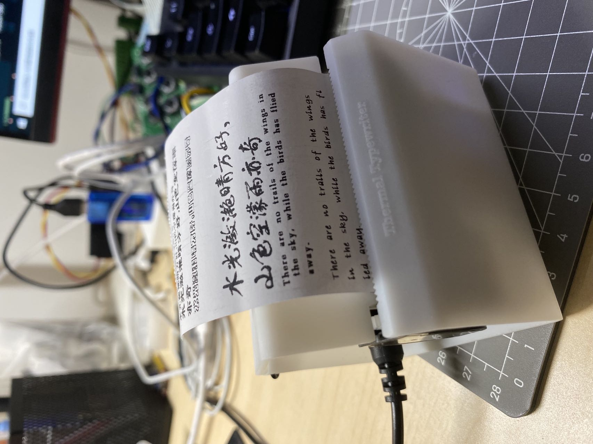
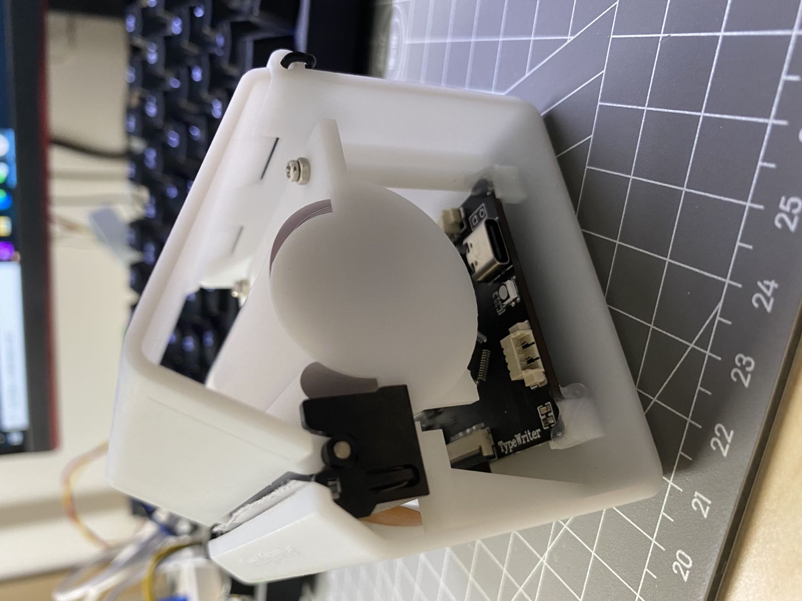
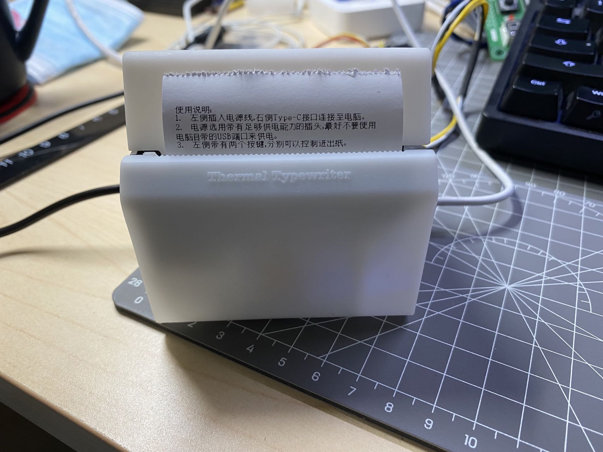
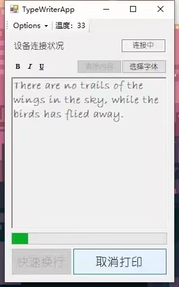

# ThermalTypePrinter

#### 介绍
2021年5月开始的热敏打字机项目，根据开源项目二次开发而来，通过上位机可以进行任意字体、长度的打印。上位机带有完整的参数显示与配置功能。

#### 软件架构
软件架构说明：STM32F103C8 + FreeRTOS / C#上位机 + 串口协议控制

#### 图片展示

#### 使用说明

1.  板卡使用USB-虚拟串口，连接至电脑后上位机可自动扫描到设备。
2.  热敏打印头长时间工作可能会过热，上位机带有打印头温度监测功能。
3.  上位机Options窗口中可以对打印偏移参数进行配置，以适应不同打印头、纸张的安装情况。
4.  带有打字机模式，可在上位机Options窗口中进行模式切换。